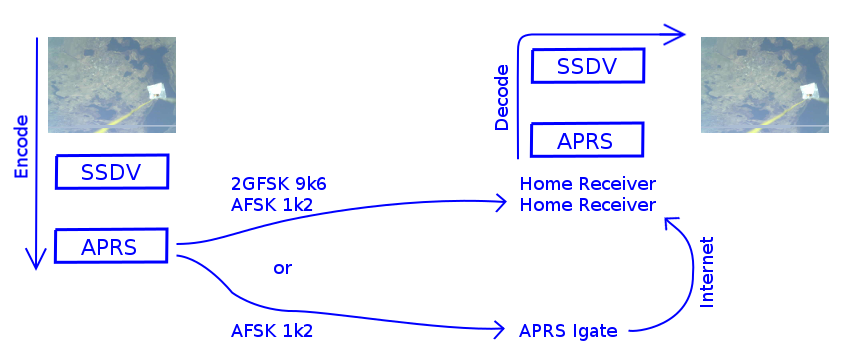
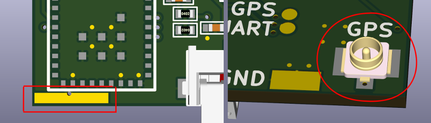
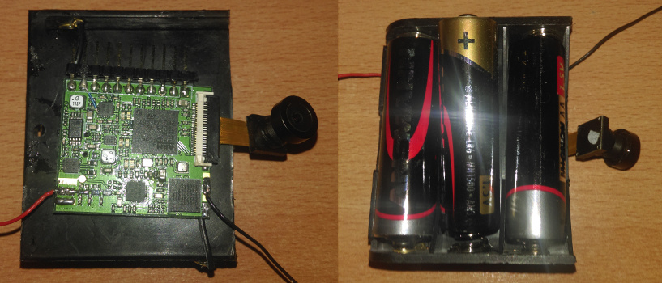
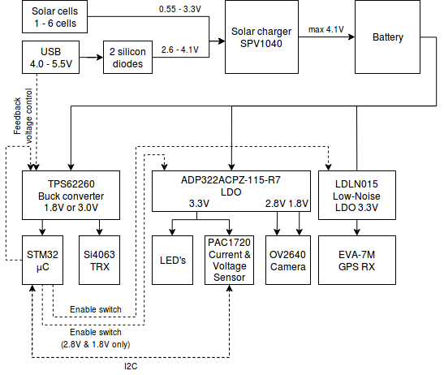

# Pecan Pico 9 - A lightweight APRS tracker for balloons
This Project contains the Pecan Pico project in it's 9th version. A Pecan is a cheap lightweight APRS position tracker designed especially for small ballons which may fly for monthes. This tracker has been made in respect of weight, functionality and price because it's usually used once like a satellite. While the balloon can fly for a long time, this tracker is solar powered and recharges it's battery at daytime and uses the power stored in the battery at night.

Note: The most recent Pecan design is [Pecan Pico 10](http://github.com/DL7AD/pecanpico10/)

 
*Pecan Pico 9a*

Other than usual position tracker, this tracker has also the ability to take pictures with a camera and send them to the ground.
The tracker can use RTTY/SSDV to transmit those to the ground. While RTTY can only be received directly, this tracker can also use APRS/SSDV. Therefore SSDV has been integraded into the APRS protocol. This new protocol allows the user to receive pcitures by using their APRS receiver and a computer. There is no tuning required, so everything could work autonomously. APRS has been integrated for the image transmission in respect to be used on the global APRS network itself. So images can be received from far away using the Igating service. Image packets may be received somewhere else by Igates and relayed through the internet. The APRS image transmission could be also used to make use of 9k6 APRS. 9k6 APRS transmits the images very fast. VGA sized pictures can be transmitted within minute. While the protocol doesn't change, using this technique doesn't need any changes rather than the decoding equipment.

 
*APRS/SSDV Transmission diagramm*

The camera can sample pictures up to UXGA (1600x1200px) but transmitting those still might take some time. The standard camera OV2640 can be bought for roughly US$5 but it can be replaced by a wide angular camera if needed using the FFC connector. Please don't expect high quality images. VGA sized pictures (640x480px) are okay but you might see the bad quality if you ramp up the resolution. Note that this tracker cannot save the pictures. That might be possible in theory but the chip (STM32F413) does only contain 1MB Flash memory and that might be enough for 20 pictures only. Here are some images which have been taken and transmitted by APRS/SSDV.

 
*Closed Airport Berlin Tempelhof roughly 3km (10,000ft) altitude*

 
*Test picture from the ground*

 
*Lakes in East Poland (Myślibórz) at 8km (25,000ft) altitude, antenna and radar reflector in the picture*

 
*South East Berlin (Adlershof/Grünau) taken at roughly 5km (16,000ft) altitude*

The tracker can transmit pictures, GPS data and telemetry data simultanously. That means that the picture transmission can be interrupted and GPS data can be sent in between. While all data can be transmitted by APRS, there is only one decive being needed to receive all the data. APRS itself doesn't need any tuning (like RTTY) so receivers may be left unattended to operate automatically. Using APRS-IS (Igates) additionally reduces the risk of missing packets. If one station miss one packet, it could be received by a different station. All packets are put together and decoded on a central server.

### GNSS
The Pecan provides a ublox EVA-7M GPS chip for localizing the tracker. It can operate up to 50km. This is important because regular GNSS receivers operate only up to 18km (60,000ft) usually and balloons may fly higher. The EVA-7M can only receive GPS. The footprint on the PCB is compabile to the ublox EVA-M8M. This GNSS chip can also receive GLONASS and and the new European GNSS network Galileo too. I have chosen the predecessor while it consumes less power. The EVA-7M can be acessed by the STM32 by UART or I2C. However the software does use UART. If there would be an error on the I2C bus, the GNSS chip will still continue to work. To avoid any interferences, the EVA-7M isn't connected to the I2C bus. It can be connected by assembling 0R resistors.

The GPS is powered through a dedicated low noise LDO with 3.3V. This LDO can be switched on and off by the STM32. The antenna can be connected by an IPEX connector on the bottom. There can be also soldered an antenna directly on the top of the PCB which have to be 4.5cm long.

 
*GNSS Antenna*

### Power management
The Pecan can be powered by LiPO batteries but also by primary lithium batteries.

If you want to use the tracker on a Latex balloon, you may use lithium batteries by Energizer which can withstand very cold temperatures (don't use Varta!). These type of batteries come in two sizes: AA and AAA. Using AAA batteries should provide sufficient power for a continous transmission of 12 hours. The battery connector of the Pecan is connected to a buck converter which can handle up to 6V. 3 batteries should be put into series and connected to it. The tracker should work flawlessly until the battery reaches 3V and should still continue to work until a input voltage of ~2V is reached. While a AAA battery weights 11.5g, the tracker has a high weight of ~45g. Primary batteries may be preferred because it's very simple to assemble.

 
*Pecan Pico 8a assembled with primary batteries*

if you want to use a foil balloon which may fly at least for some days, you would rather stick to LiPO batteries. LiPO batteries are used with solar cells in common which can be soldered to the backside of the Pecan or connected to pinheaders on the side. The Pecan can be also used with solar cells only but it wouldn't work at night.

At night temperatures low as -50°C can be reached. So operating the tracker with LiPO batteries is quite difficult but not impossible. If the operation can be reduced to transmission only, the tracker might work trough the night. Aquiring a GPS fix may draw too much current. At the moment, there is no good solution for this problem yet, so you might stop the GPS operation at night.
The LiPO battery should be connected to the battery terminals on the backside of the Pecan. If a solar cell is connected to the Pecan too, it will charge the battery. The battery can also be charged trough USB. Solar cells must not be connected with USB at the same time while USB while both supplies are connected on the same network. The USB voltage is fed through 2 silicon diodes to the SPV1040. This has been done because USB may provide up to 5.5V, which is too much for the SPV1040's input.

The solar and battery voltage can be measured by voltage dividers connected to the STM32. In respect to save energy, those dividers have an impedance of 32kOhm. While the STM32 has a low input impedance too, the measurement is probably not that accurate. Therefore the PAC1720 can be used which can measure voltage and current consumption at the same time. This chip can be accessed by I2C and is fairly accurate.

The following picture shows a power management diagram of the Pecan Pico 9a

 
*Power Diagram*

The internal operation voltage of the microcontroller and transmitter is 1.8V. This voltage has been chosen while the microcontroller draws less power at low voltages. However USB operatopm requires 3V at least. Also the transmitter does radiate less power at low voltages. Therefore the operation voltage can be ramped up either by connecting a USB host or by the *V_BOOST* pin of the STM32.

A USB host (like a computer) does provide a GND signal through the USB ID pin. This pin was originally used to indicate a USB host has been connected (rather than a slave). On the Pecan this pin is connected to the feedback resistor network of the buck converter. If USB is connected the voltage is ramped up to 3.0V. It isn't possible to connect USB slaves (like a USB stick) to the Pecan, because USB slaves don't provide a GND signal on the USB ID pin. So the STM32 will run at 1.8V which is insufficient voltage for USB operation.

### Transmitter
The transmitter is based on a Si4063 which can do up to 100mW (at an operation voltage of 3.3V). It is able to transmit FSK, GFSK and OOK (On/Off-Keying). 2FSK is better known as RTTY and OOK as CW (morse). 2GFSK can be used for 9k6 APRS. APRS 1k2 which uses AFSK is archived by a 2GFSK modulation. The chip itself has never been intended to modulate AFSK, but its possible. The Pecan has a 2m low pass filter (LPF), so it cannot transmit on the 70cm band. Transmitting at 70cm would be possible by the chip, if the LPF is replaced by a 70cm version. Due to the low operation voltage (1.8V), the Pecan does transmit only at 30...40mW in general. This should be enough for APRS operation. However it is possible to ramp up the operation voltage to 3.0V by the microcontroller itself and get up to 70...80mW.

###

Unsolved problems
=================

As mentioned before, the battery might freeze at night. LiPO's are already a good option and I don't know a battery which works better. LiPO's work best at warm temperatures (~20°C). At low temperatures the battery has a high internal resistance, which reduces the possible amount of current that can be used until the battery voltage drops too much. So what can we do? There are three options:

- Make the battery larger => Problem: It increases the total weight
- Heat the battery => Problem: It might need a larger battery to heat it all trough the night and that increases the total weight
- Draw less current

Option one and two are bad. Having more weight means that we can only fly at lower altitudes. The possibility to get into rain at a low altitude is much higher. Recovering the balloon from rain is impossible. It will descent to the gound, caught by a tree and it will never fly again.

So the only option is, to draw less current. Idling and a short APRS transmission is okay for the battery. Measuring the temperature, airpressure and humidity is okay too. However aquiring a GPS fix draws too much current.

Author
======

Please let me know if you have questions or ideas: sven.steudte@gmail.com

